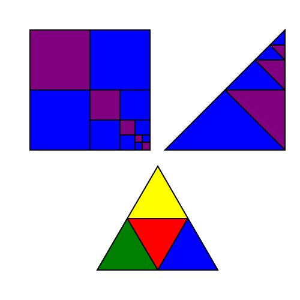

# Symbol Magic

    Symbol: Geometry with meaning

    Magic: Replication of desire

[✡️ ⭐ 🔺 🟦  Buy the Shapes of Reality](shapes/)

[📬 Buy self-replicating post card](https://www.actiongeometry.com/postcard)

[🧙Summon a wizard](contact/)

[🍄More self-replicating media](srm/)

