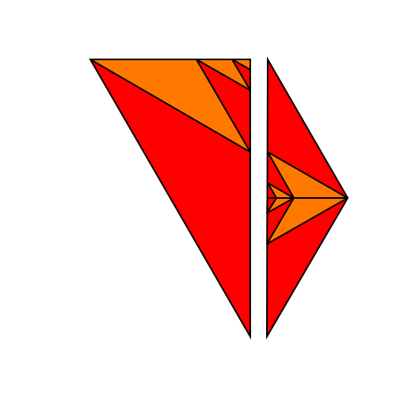
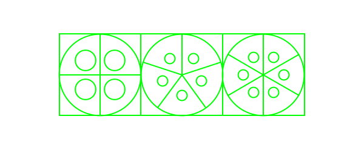
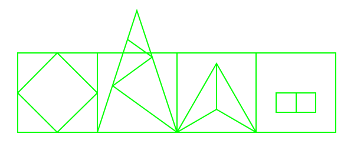

[Link up a level](../)

[edit this page](scrolleditor.html)

# Shapes of Reality

### [link to buy the acrylic shapes](https://www.actiongeometry.com/shapes)

These shapes represent the core symmetries and scales that define our Reality.  They allow us to create self-replicating symbols which anyone else with the shape set can easily and reliably copy without any artistic skill.  All shapes are laser cut from florescent green acrylic.

To replicate the Book of Shapes(a sefl-replicating geometry book), fold a stack of about 5 pages of standard printer paper in half twice(into quarters), cut along one side to make it a booklet, then either staple the spine or punch holes in it with a thumb tack and sew it to bind it into a booklet.  Trace all shapes, color them in, label them as you see fit.  If you have the Shape of Reality and share them with many people in a location with art supplies, an unlimited number of books can be created at zero cost.

## Symmetry Glyphs

## Scale Glyphs

