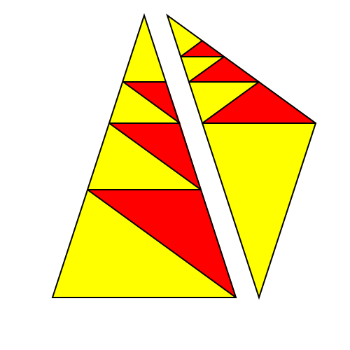

[Link up a level](../)

[edit this page](scrolleditor.html)

# Shapes of Reality

### [link to buy the acrylic shapes](https://www.actiongeometry.com/shapes)

These shapes represent the core symmetries and scales that define our Reality.  They allow us to create self-replicating symbols which anyone else with the shape set can easily and reliably copy without any artistic skill.  All shapes are laser cut from florescent green acrylic.

## Symmetry Glyphs

## Scale Glyphs

