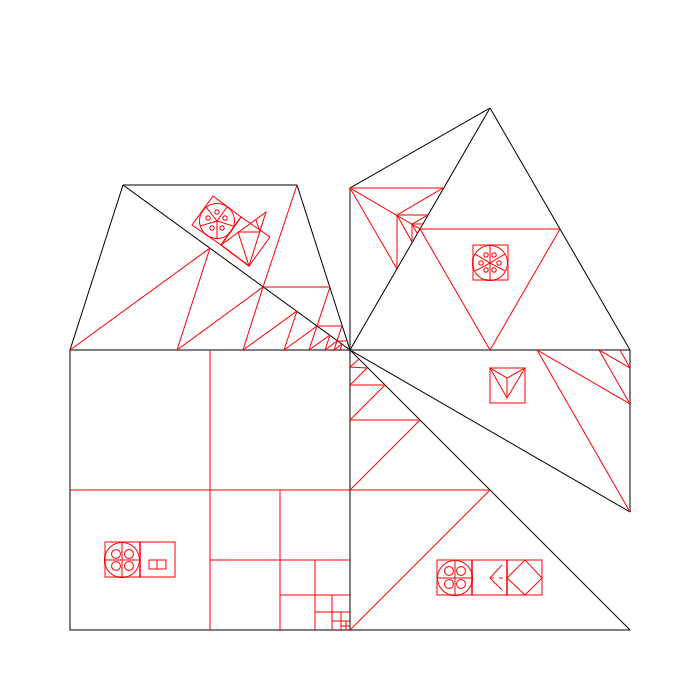
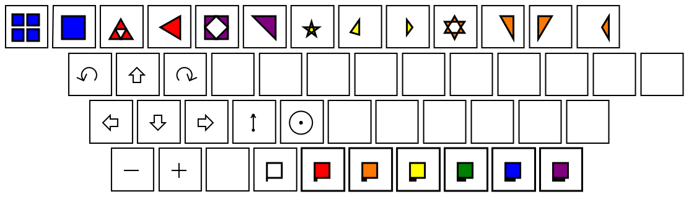

[../](../)

[link back to symbol editor](index.html)

[editor.php](editor.php)

    &#x0393;
    &#x03b5;
    &#x03c9;
    &#x03bc;
    &#x03b5;
    &#x03c4;
    &#x03c1;
    &#x03bf;
    &#x03bd;

# Geometry in this place physically here, with words about this factory, url, links etc

[fork.html](fork.html)

symmetries

scales

shapes

laser cut shapes

printed paper shapes, print in 3 inches, 6 inches size, trace onto cardboard for tiles, pdfs(?) to print in the iconsymbol directory or just svgs to replicate(yes, this)

cardboard penrose tiles sold for cash

cardboard shape set sold for cash

passerby make tiles on sidewalk

station has bucket of water and scrub brush to remove chalk periodically

urls point to simplified action geometry symbol langauge instance

keyboard stickers, pdf to print

replication

cardboard shapes, 4-18 inches, chalk on cement

sharpies, box cutters, string and thumb tack(for circles)

artbox made of cardboard and tape for collection of cash money for shared funds

links to all the things, to replicate downard in tree using seed

