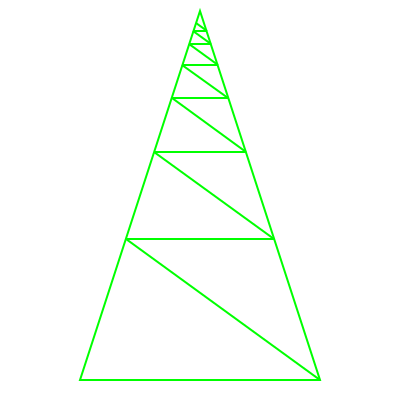
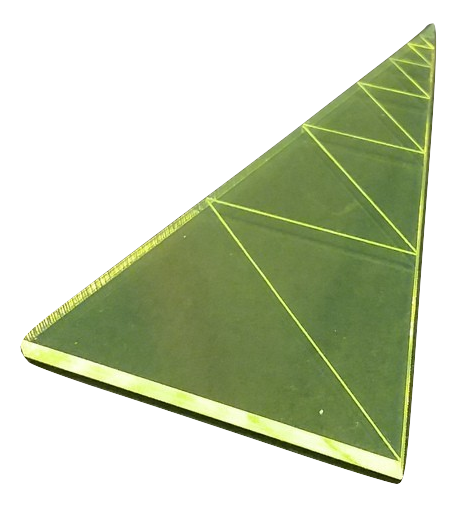
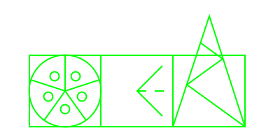
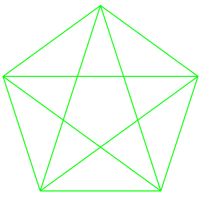
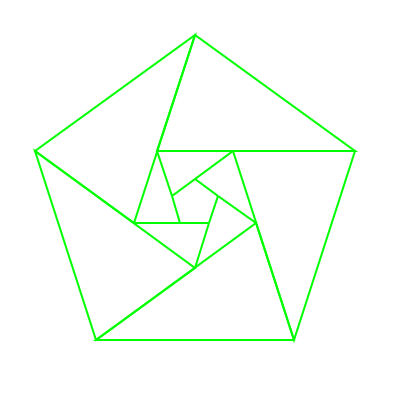
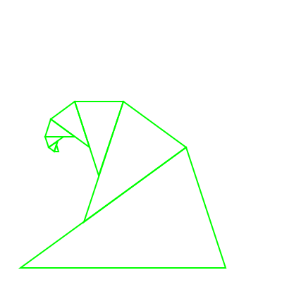

# Symbol Magic

## Information is physical

## Golden Triangle

## Plastic shape

## Geometron symbols for symmetries and scales

## Pentagram

## Pentagonal Iris

## Spiral

Follow the hashtag you see on the card you found on social media(primarily [instagram](https://www.instagram.com/)).  Replicate the card.  Add messages to cards and distribute.  Use social media on that hashtag to share locations of cards.  Social media points to cards and triangles, cards point to social.  

Choose a domain name based on your public physical location(not an exact address).  Choose a top level domain other than .com like .xyz, .net or .org.  Create a hashtag based on that domain, spelling out the word "dot" e.g. #brandywinebridgedotxyz or #minasmorguldotnet.  Buy the domain, get hosting either on a paid host like [dreamhost](https://www.dreamhost.com/) or a free host like [000webhost](https://www.000webhost.com/), create a new file in the main web directory for your new domain in your hosting account called "replicator.php", and copy the code from [the local replicator file from this web page](php/replicator.txt) to the new site.  Point a browser to [www.yournewdomainname.xyz]/replicator.php, click through on the links, and you have replicated this page to a new place, which has a new hashtag. Create physical media using the Golden Triangle which has the hashtag and domain for this place and distribute publicly along with physical Golden Triangles.  

To get more Golden Triangles, buy them in bulk from the laser cut on demand company [Ponoko.com](https://www.ponoko.com).  Download the file used to create them here:

[21triangles.svg](iconsymbols/21triangles.svg)

Each unit will be 21 shapes, so 100 sets are 2100 triangles is a lot of triangles.  When you upload to ponoko.com you'll need to specify the width of the file, that is 7.42 inches to make triangles that are 3 inches on the long sides.  Select neon green transluscent acrylic, 0.12 inches thick.  In quantities of about 1000 triangles this should break down to about 50 cents per triangle.  Buy in bulk and distribute in art/coffee locations.  Note the "etch" layer is the one with the small detail triangles(red) and the "cut" layer is just the outlines.  This shape can also be printed out using a public laser cutter in the maker space of a public library.  Check your local public library for laser cutter availability and look for when the safety training class is.  

